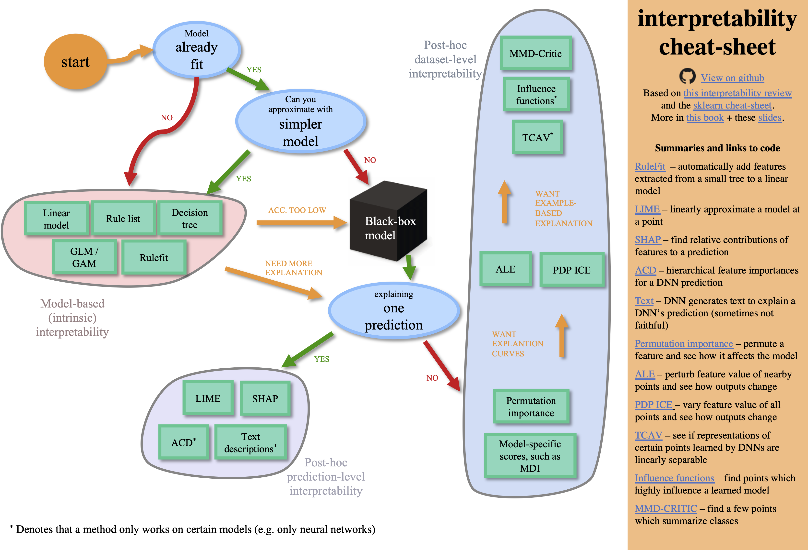

<h1 align="center"> Interpretable machine learning models (imodels) </h1>
<p align="center"> Straightforward implementations of interpretable ML models + demos of how to use various interpretability techniques. Code is optimized for readability. Pull requests welcome!
</p>

<p align="center">
  <a href="#implementations-of-interpretable-models"> Implementations of imodels </a> •
  <a href="#demo-notebooks">Demo notebooks</a> •
  <a href="https://docs.google.com/presentation/d/1RIdbV279r20marRrN0b1bu2z9STkrivsMDa_Dauk8kE/present">Accompanying slides</a>
</p>


## Implementations of interpretable models
Provides scikit-learn style wrappers/implementations of different interpretable models (see readmes in individual folders within [imodels](imodels) for details)

- [bayesian rule list](https://arxiv.org/abs/1602.08610) (based on [this implementation](https://github.com/tmadl/sklearn-expertsys)) - learn a compact rule list
- [rulefit](http://statweb.stanford.edu/~jhf/ftp/RuleFit.pdf) (based on [this implementation](https://github.com/christophM/rulefit)) - find rules from a decision tree and build a linear model with them
- [sparse integer linear model](https://link.springer.com/article/10.1007/s10994-015-5528-6) (simple implementation with cvxpy)
- greedy rule list (based on [this implementation](https://medium.com/@penggongting/implementing-decision-tree-from-scratch-in-python-c732e7c69aea)) - uses CART to learn a list (only a single path), rather than a decision tree
- [skope-rules](https://github.com/scikit-learn-contrib/skope-rules) (based on [this implementation](https://github.com/scikit-learn-contrib/skope-rules))
- (in progress) [optimal classification tree](https://link.springer.com/article/10.1007/s10994-017-5633-9) (based on [this implementation](https://github.com/pan5431333/pyoptree)) - learns succinct trees using global optimization rather than greedy heuristics
- [iterative random forest](https://www.pnas.org/content/115/8/1943) (based on [this implementation](https://github.com/Yu-Group/iterative-Random-Forest))

The interpretable models within the [imodels](imodels) folder can be easily installed and used:

`pip install git+https://github.com/csinva/interpretability-implementations-demos`

```python
from imodels import RuleListClassifier, RuleFit, GreedyRuleList, SkopeRules, SLIM, IRFClassifier
model = RuleListClassifier()  # initialize Bayesian Rule List
model.fit(X_train, y_train)   # fit model
preds = model.predict(X_test) # discrete predictions: shape is (n_test, 1)
preds_proba = model.predict_proba(X_test) # predicted probabilities: shape is (n_test, n_classes)
```

## Demo notebooks
The demos are contained in 3 main [notebooks](notebooks), following this cheat-sheet:

1. [model_based.ipynb](notebooks/1_model_based.ipynb) - how to use different interpretable models
2. [posthoc.ipynb](notebooks/2_posthoc.ipynb) - different simple analyses to interpret a trained model
3. [uncertainty.ipynb](notebooks/3_uncertainty.ipynb) - code to get uncertainty estimates for a model


## References / further reading

- [high-level review on interpretable machine learning](https://arxiv.org/abs/1901.04592)
- [book on interpretable machine learning](https://christophm.github.io/interpretable-ml-book/)
- [review on black-blox explanation methods](https://hal.inria.fr/hal-02131174v2/document)
- [review on variable importance](https://www.sciencedirect.com/science/article/pii/S0951832015001672)
- for updates, star the repo, [see this related repo](https://github.com/csinva/csinva.github.io), or follow [@chandan_singh96](https://twitter.com/chandan_singh96)
